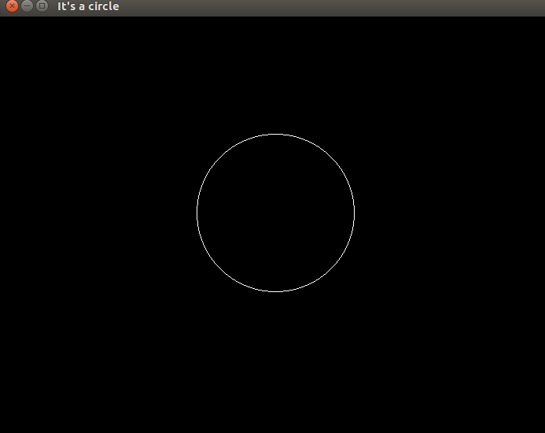

# GVC OpenGL Lab Assignments

## Language
```
C++
```
## How to Run

> **Note:** Use **g++ filename.cpp -lglut -lGLU -lGL** command on terminal.

## List
* **DDA** :- A line drawn using DDA algorithm .

* **Bresenhem** :- A line drawn using Bresenhem algorithm .

* **Square** :- A square whose sides are drawn using DDA algorithm .

* **Circle** :- A cricle drawn using mid-point algorithm .

* **ellipse** :- A ellipse drawn using mid-point algorithm .

* **drawing** :- A drawing consisting of three-four kinds of shapes.

* **Transformation** :- A traingle is tranformed using scaling and rotating.The in-built functions are **not** used.
